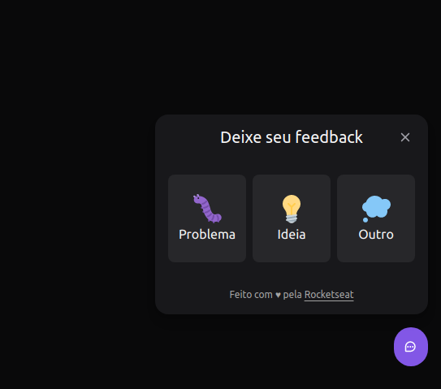
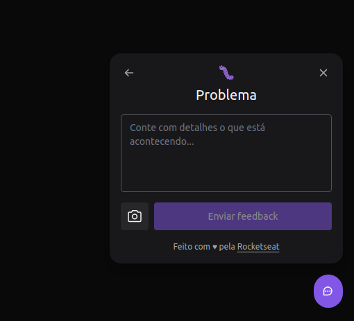
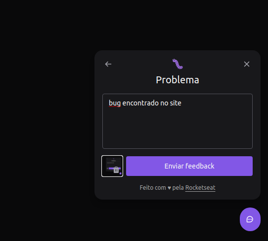
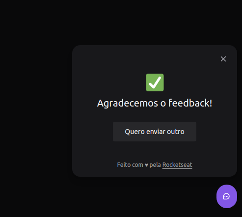

## 💻 Projeto

Bem-vindo ao nosso portal de feedback do site! Aqui, você pode compartilhar seus pensamentos, relatar bugs, sugerir ideias ou fornecer qualquer outro tipo de feedback relacionado ao nosso site. Queremos ouvir sua opinião e melhorar sua experiência!

Como funciona?
* Escolha o tipo de feedback: Bug, Ideia ou Outro.
* Se você encontrou um bug, descreva-o detalhadamente. Se tiver uma ideia, explique-a claramente. Caso seja outro tipo de feedback, forneça os detalhes relevantes.
* Se desejar, tire um print da tela atual para nos ajudar a entender melhor o problema ou ilustrar sua ideia. Clique no botão "Capturar Tela" para fazer isso automaticamente.
* Preencha seus dados de contato (opcional) para que possamos entrar em contato com você, se necessário.
* Clique em "Enviar" para nos enviar seu feedback.
* Capturar Tela
* Ao clicar no botão "Capturar Tela", você terá a opção de selecionar uma área específica da tela para capturar como evidência. Isso nos ajudará a entender melhor o contexto do problema ou visualizar sua ideia com mais clareza.

<h1 align="center">
    <a href="https://feedback-widget-web-two.vercel.app/">🔗 FeedbackWidget</a>
</h1>

<strong>Botão Widget:</strong>
<br/>


<strong>Widget Aberto:</strong>
<br/>


<strong>Tipo de Feedback selecionado:</strong>
<br/>


<strong>Formulário preenchido:</strong>
<br/>


<strong>Feedback enviado:</strong>
<br/>

    
## ✨ Tecnologias

-   [ ] React
-   [ ] Typescript
-   [ ] Popover
-   [ ] TailwindCSS
-   [ ] Vite
-   [ ] Phosphor Icons
-   [ ] Axios


## :hammer_and_wrench: Features 

-   [ ] Criação do componente Widget
-   [ ] Abrir Opções de feedbacks após o clique no componente Widget
-   [ ] Abrir Formulário após o clique na opção que ele deseja
-   [ ] Tirar print da tela após clicar no ìcone de câmera e armazenar para utilizar posteriormente
-   [ ] Tirar print da tela após clicar no ìcone de câmera e armazenar para utilizar posteriormente
-   [ ] Após o usuário digitar e tirar o print da tela e clicar em enviar, enviar a requisição de Post pro backend.
-   [ ] Tela de Sucesso após eviar a requisição.


## 🚀 Como executar

Clone o projeto e acesse a pasta do mesmo.

```bash
$ git clone https://github.com/FernandaZaccaroRigolin/FeedbackWidgetReact

```

Para iniciá-lo, siga os passos abaixo:
```bash
# Instalar as dependências
$ yarn
# Iniciar o projeto
$ yarn dev
```
O app estará disponível no seu browser pelo endereço http://localhost:3000.
